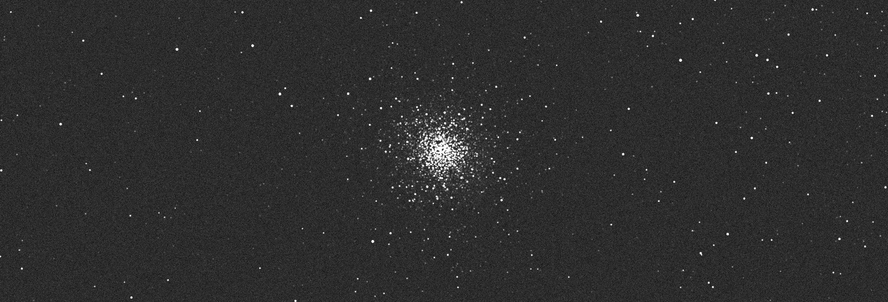

# cabaret

*cabaret* is a Python package to simulate astronomical images using the [GAIA catalog](https://en.wikipedia.org/wiki/Gaia_catalogues) of stars.
## Installation

You can install *cabaret* in a Python (`>=3.11`) environment with

```bash
pip install cabaret
```

or from a local clone

```bash
git clone https://github.com/ppp-one/cabaret
pip install -e cabaret
```

You can test the package has been properly installed with

```bash
python -c "import cabaret"
```

## Example

### Basic image 

To generate an image from RA/DEC coordinates, run:
```python
import cabaret

image = cabaret.Observatory().generate_image(
    ra=12.33230,  # right ascension in degrees
    dec=30.4343,  # declination in degrees
    exp_time=10,  # exposure time in seconds
)
```

To display the image (`matplotlib` required here):

```python
import matplotlib.pyplot as plt
from cabaret.plot import plot_image

plot_image(image)
plt.show()
```

### Configuring an Observatory

You can customize the physical characteristics of the observatory by defining and passing Camera, Telescope, and Site objects.

```python
import datetime
import cabaret

# Define the observatory with specific characteristics
observatory = cabaret.Observatory(
    name="MyObservatory",
    camera=cabaret.Camera(
        name="MyCamera",
        height=1024,  # Height of the camera in pixels
        width=1024,  # Width of the camera in pixels
        read_noise=10,  # Read noise in electrons
        gain=1,  # Gain in e-/ADU
        pixel_defects=dict(
            cold_pixels=dict(rate=0.005, value=300, seed=42)  # defaults to ConstantPixelDefect
        ),
    ),
    focuser=cabaret.Focuser(best_position=10_000, scale=100, max_seeing_multiplier=5.0),
    site=cabaret.Site(sky_background=21.0, seeing=1.5),
    telescope=cabaret.Telescope(diameter=1.0, focal_length=8.0),
)

# Generate an image with the configured observatory
image = observatory.generate_image(
    ra=12.33230,  # right ascension in degrees
    dec=30.4343,  # declination in degrees
    exp_time=10,  # exposure time in seconds
    dateobs=datetime.datetime.now(datetime.UTC),  # time of observation
    filter_band="G",  # Photometric filter used in simulation
)
```

You can easily save your observatory configuration to a YAML file:
```python
observatory.save_to_yaml("path/to/config_file.yaml")
```
To load a previously saved configuration, you can use:
```python
observatory.load_from_yaml("path/to/config_file.yaml")
```

Additionally, you can generate images from a list of Sources
```python
sources = cabaret.Sources.from_arrays(
    ra=[10.64, 10.68], dec=[10.68, 41.22], fluxes=[169435.6, 52203.9]
)
image = observatory.generate_image(
    ra=sources.ra.deg.mean(),
    dec=sources.dec.deg.mean(),
    exp_time=10,
    seed=0,
    sources=sources,
)
```
